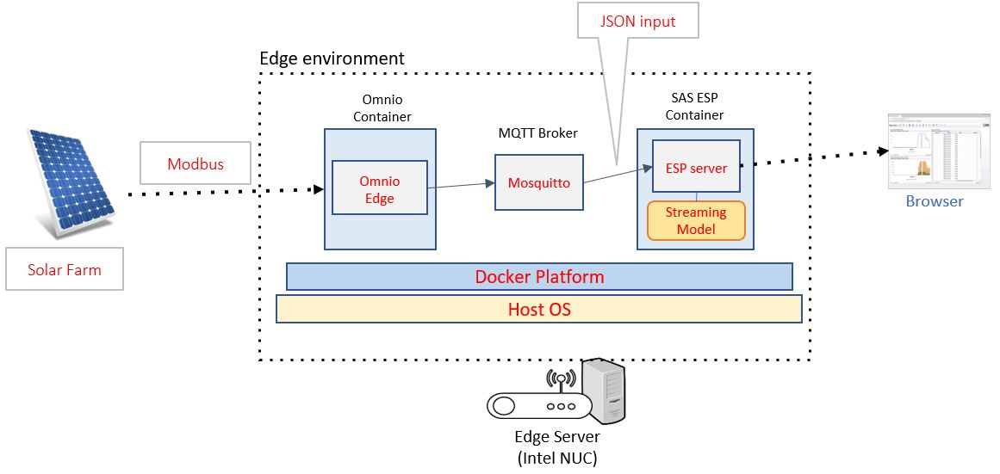
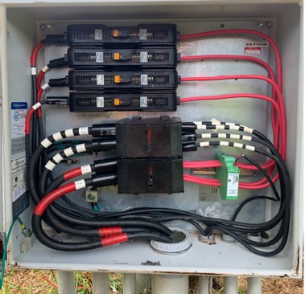
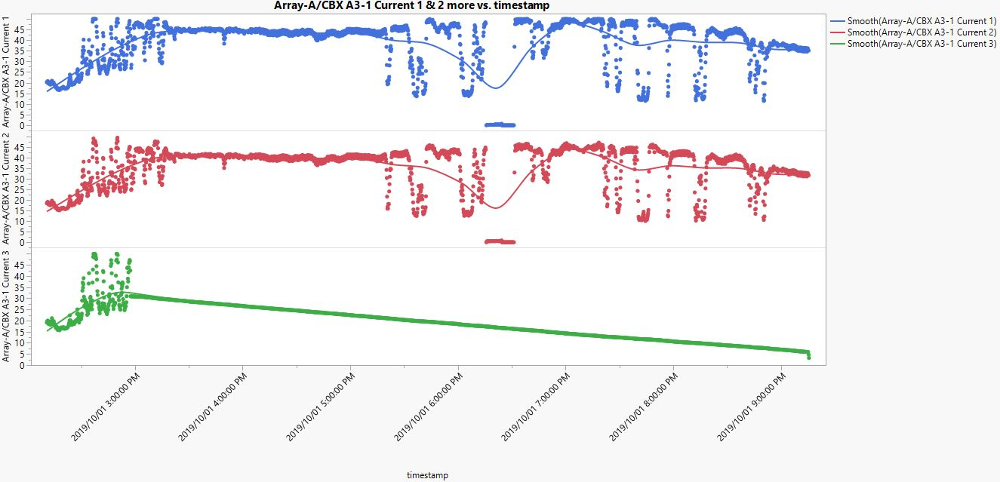
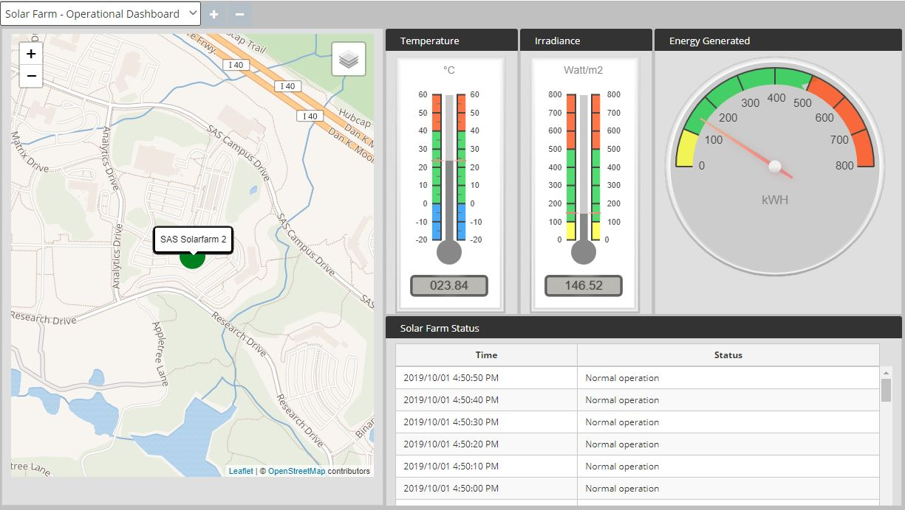
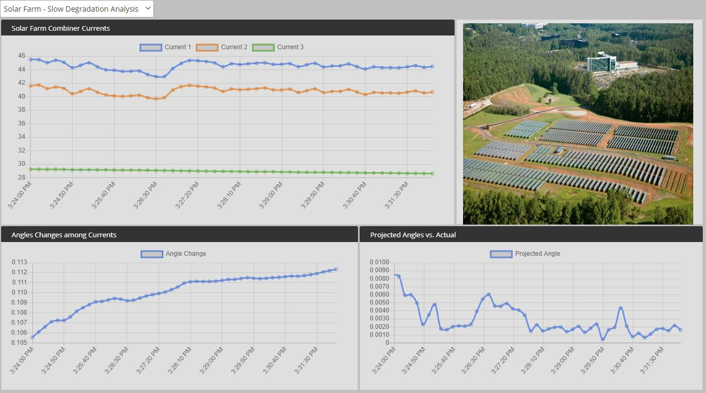
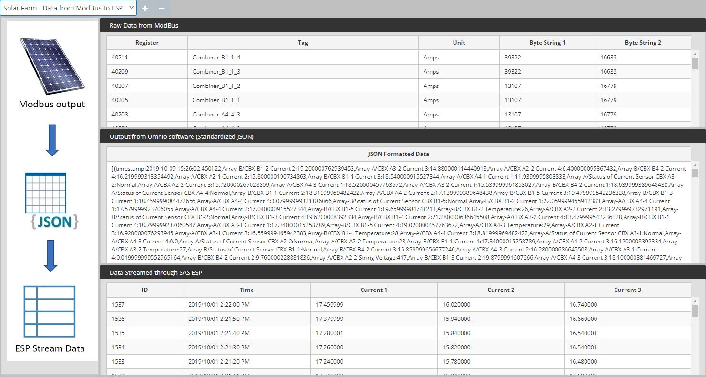

# Archived repository

### Notice: The functionality provided in this repository is dated. Hence, the repository will no long accept submissions or offer support.

---------

# SAS ESP and Omnio Integration to bring analytics to the Edge

    

## Overview

This reference architecture walks you through the decision-making process involved in designing, developing, and integrating [SAS Event Stream Processing Edge 6.1](https://go.documentation.sas.com/?cdcId=espcdc&cdcVersion=6.1&docsetId=espstudio&docsetTarget=titlepage.htm&locale=en) (ESP) and [Omnio Industrial IoT solution](https://www.omnio.net/product).  By leveraging Omnio’s plug-and-play connectivity as a service, ESP is able to provide a wide range of analytical capabilities to your IoT solutions. Omnio's edge translation layer onboards your devices, ensuring interoperability, reporting all device data in one format, customized to your existing IoT platform. 

In this use case, the ESP and Omnio integration is used to read data from various sensors installed in the solar farm located at the SAS HQ, in Cary, North Carolina. The sensor data includes inverter data, real-time weather data, and combiner boxes data. The data is then used both for building a reporting dashboard and training a [Subspace tracking](https://github.com/sassoftware/iot-high-frequency-algorithms-for-applications/blob/master/docs/sst.md) (SST) model to detect both hardware failures in the solar farm and slow degradation of slow panels.

### Prerequisites

*  [SAS Event Stream Processing Edge 6.1](https://go.documentation.sas.com/?cdcId=espcdc&cdcVersion=6.1&docsetId=espstudio&docsetTarget=titlepage.htm&locale=en)
*  [SAS Event Stream Processing Streamviewer 6.1](https://go.documentation.sas.com/?cdcId=espcdc&cdcVersion=6.1&docsetId=espvisualize&docsetTarget=titlepage.htm&locale=en)
*  [Omnio Industrial IoT solution](https://www.omnio.net/product)

## Getting Started

## Architecture



This integration follows the above architecture where both the Omnio and ESP edge containers are running in an edge machine (such as Intel NUC). The Omnio container connects to the Modbus gateway located in the solar farm and reads the sensor data stored in the modbus registers. The modbus registers store the data in short int64 and each sensor value is spread across two registers. The Omnio container converts the modbus register data into a decimal value and publishes it as JSON structure in the MQTT server. The ESP container runs an ESP project that parses the published JSON from MQTT and uses the data for training the Subspace Tracking model (SST) to detect the slow degradation in one of the combiner boxes. There is also a rule-based outlier detection to detect a large step change in one of the combiner box currents which indicates hardware failure. The output of the model is visualized using the dashboards created using the IoT Toolbox.

*Inside view of a combiner box*


### Installation

To reduce the complexity of connecting to the secure solar farm server, the ESP model will read the data from a csv file instead of subscribing to the JSON data from the Omnio container. The user should follow the steps below to setup the demo. 

(Note: All the components related to this demo are stored under different folders in the Git repository.) 

| Directory | Contents |
| :------ | :------ |
| data |The combiner box data, weather/inverter data, and modbus raw data in csv format |
| docker_images |ESP docker container image and Omnio docker container image |  
| docs |Support files |
| IoT_Toolbox |Jar files to run the dashboards |
|project|ESP XML files and streamviewer database file|
|scripts|Startup scripts for ESP XML server and Streamviewer|

To help streamline and simplify the process, the complete ESP project is bundled in a docker container. To configure the docker container and the IoT Toolbox, you need to complete the following steps:

1. Install the following utilities or software on the host machine 
    ```docker utility```
    ```Java 1.8 or more```
    ```mosquitto mqtt```

2. Download the docker image "solarfarm_demo_master.tar" from the docker_images folder to your local. Then load the docker image to your local docker repository.

   ```docker load < solarfarm_demo_master.tar```

3. At this point, you should be able to see the docker image "docker.sas.com/razsha/solarfarm_demo_master" under the local docker image repo. 

    ```docker image ls```

4. Download the **IoT_Toolbox** directory from the gitlab and save it under the home directory of the user. 

5. Create a folder named **"SV"** under the home directory of the user. 

6. Download the file **"h2db.ravi.mv.db"** from the project directory in Gitlab and copy it to the SV directory that was created in the previous step.

7. Download the startup script **"startup.sh"** from the scripts directory in Gitlab and save it in the home directory of the user. 

8. Run the startup script to start the ESP docker container and the IoT_Toolbox.

    ``` ./startup.sh ```

9. Access the IoT Toolbox dashboards at **http://localhost:8090**

10. Alternatively, you can access the ESP streamviewer dashboards at http://localhost:52500 (Note: These dashboards are same as the IoT Toolbox dashboards. The user can choose to use)

**Note: The model can run for five days as it cycles the same data in a loop. If the data flow is not in the dashboard, re-run the startup script ```./startup.sh``` to reset the model.  **

### Data Description 

The following datasets are available under the "data" directory in the GitLab. The ESP model uses all the four datasets.

| Name | Description |
| :------ | :------ |
| [Combiner_Data.csv](data/Combiner_Data.csv) | Combiner Current data from 9 AM to 5 PM EST recorded on 10/01/2019|
| [combiner_json.csv](data/combiner_json.csv) | Combiner current data in JSON published by Omnio container |
| [Raw_Modbus_Data.csv](data/Raw_Modbus_Data.csv) | Raw modbus register data which is being consumed by the Omnio application |
|[weather.csv](data/weather.csv)|Inverter and weather data from the solar farm |

### Data Exploration

The SST model is using the current data from the combiner boxes. The inputs are three combiner currents named Current_A3_1_1, Current_A3_1_2, and Current_A3_1_3. From the below chart, we can see that there is a degradation in one of the combiner currents Current_A3_1_3. The purpose of the SST model is to detect the slow degration and alert the user.



### Build and Test Streaming Model

The SST model is an online streaming algorithm that comes with SAS ESP. The online model denotes that the model will be trained using the streaming data (first 35 events in this case) and updated for every set of events. An in-depth detail about the working of SST model is present in the link [Subspace tracking (SST)](https://gitlab.sas.com/IOT/accelerators/high-frequency-algorithms-for-iot-applications/blob/master/docs/sst.md)

The following properties were used for window-based method:

| Name | Value |
| :------ | :------ |
| windowLength | 35 |
| maxPrincipal | 3 |  
| overlap | -1 |

See instructions to [build and test model](docs/Build Model.md) using SST in **SAS Event Stream Processing Studio**.

### Result Interpretation

The following dashboards are available under the IoT_Toolbox application. It can be accessed using the URL http://localhost:8090

##### Operational Dashboard
This dashboard gives the user an overall status of the solar farm. The map shows the location of the solarfarm and the bubble indicates the status.

| Color | Status |
| :------ | :------ |
| Green | Normal Operation |
|Yellow | Large step change | 
|Red | Slow degradation |


   
##### Slow Degradation Analysis
This dashboard shows the input currents to the SST model. It also shows the Absolute angle change between Principal comppnent vector between windows and Projected Angle. When there is a degradation, the Absolute Angle change will deviate from 0.



##### Modbus data view
This dashboard shows the process of converting the raw modbus data into JSON and further into tabular format consumed by the ESP model. This showcases the need for Omnio application to provide sensor data in the format that can be consumed by data scientists.



### Summary

This demo helps the user monitor the solar farms and predict failure exactly at panel level. The SST model elimiates the legacy rule based model and it adapts to the data irrespective of the weather conditions. This model can be applied to any IoT project where similarly functioning devices has to be tracked such as wind mills, industrial equipments, turbines etc. 

### Troubleshooting

The logs for docker container can be obtained using
 ```docker logs <container id>```

To reset the ESP model,run the startup script
``` ./startup.sh ```

## Contributing

This project does not accept contributions

## License

This project is licensed under the [Apache 2.0 License](LICENSE).

## Additional Resources

* SAS Event Stream Processing 6.1 : [Documentation](https://go.documentation.sas.com/?cdcId=espcdc&cdcVersion=6.1&docsetId=espan&docsetTarget=p0dv9t241gp1ptn13vo75aol2d1b.htm&locale=en)
* Omnio Industrial IoT Help : [Omnio Products](https://www.omnio.net/product)
